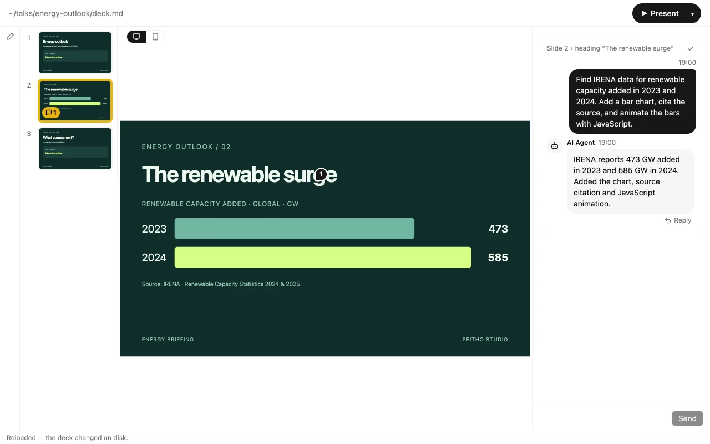

# Peitho Studio

A desktop editor for [Peitho](https://github.com/mizzy/peitho) presentations: Markdown as the source of truth, HTML slides you can interact with. Use HTML, CSS and JavaScript to build slides your audience can explore. Edit them yourself, work with an AI coding agent, or use both.

[Website](https://peitho-studio.piconic.ai/) · [Download](https://github.com/piconic-ai/peitho-studio/releases/latest)

[](https://peitho-studio.piconic.ai/#demo)

[Watch the demo](https://peitho-studio.piconic.ai/#demo): comment on a slide, send it to your agent, and review the updated deck.

## Features

- **Slides you can interact with.** Peitho renders HTML slides, so you can use JavaScript for interactive diagrams, simulations and demos. Studio previews layout scripts once you trust the deck folder ([details](docs/layout-scripts.md)).
- **Markdown editing with live preview.** Navigate your slides, edit their source and speaker notes, and see the rendered result alongside them.
- **Your files, your tools.** Decks stay in plain Markdown and HTML. Edit them in Studio, another editor or an AI coding agent; Studio automatically reloads external changes.
- **Comments for your AI Agent.** Leave feedback on specific slide elements, send it to your connected coding agent, and review its replies and changes in Studio.
- **Present with Peitho.** Launch your deck from Studio using the `peitho` CLI.

## Install

For Apple Silicon Macs running macOS 13 (Ventura) or later:

```sh
brew install --cask piconic-ai/tap/peitho-studio
```

You can also download a macOS build from [GitHub Releases](https://github.com/piconic-ai/peitho-studio/releases/latest) and move Peitho Studio to Applications.

## Contributing

See [CONTRIBUTING.md](CONTRIBUTING.md) for development setup, checks, pull requests and release maintenance.

## License

Source code is licensed under the [MIT License](LICENSE). The Peitho Studio name and app icon remain reserved as project branding.
